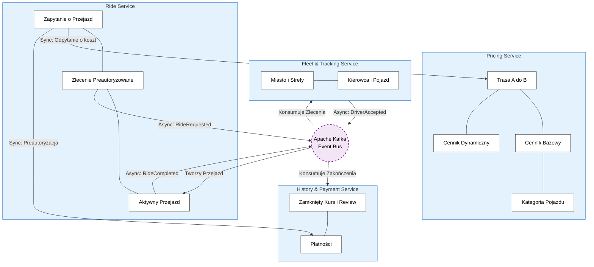

```mermaid
graph TD
    classDef service fill:#e3f2fd,stroke:#1565c0,stroke-width:2px,color:#000;
    classDef aggregate fill:#fff,stroke:#333,stroke-width:1px,color:#000;
    classDef external fill:#f3e5f5,stroke:#7b1fa2,stroke-width:2px,stroke-dasharray: 5 5,color:#000;

    subgraph Pricing_Service [Pricing Service]
        CB[Cennik Bazowy]:::aggregate
        KP[Kategoria Pojazdu]:::aggregate
        CD[Cennik Dynamiczny]:::aggregate
        TR[Trasa A do B]:::aggregate
    end

    subgraph Fleet_Service [Fleet & Tracking Service]
        M[Miasto i Strefy]:::aggregate
        K[Kierowca i Pojazd]:::aggregate
    end

    subgraph Ride_Service [Ride Service]
        ZAP[Zapytanie o Przejazd]:::aggregate
        ZLE[Zlecenie Preautoryzowane]:::aggregate
        PR[Aktywny Przejazd]:::aggregate
    end

    subgraph History_Service [History & Payment Service]
        HR[Zamknięty Kurs i Review]:::aggregate
        PAY[Płatności]:::aggregate
    end

    KAFKA((Apache Kafka<br>Event Bus)):::external

    %% Relacje wewnątrz serwisów
    CB --- KP
    TR --- CB
    TR --- CD
    ZAP --- ZLE
    ZLE --- PR
    HR --- PAY
    M --- K

    %% Komunikacja Synchroniczna (REST/gRPC)
    ZAP -->|Sync: Odpytanie o koszt| TR
    ZAP -->|Sync: Preautoryzacja| PAY

    %% Komunikacja Asynchroniczna (KAFKA)
    ZLE -->|Async: RideRequested| KAFKA
    KAFKA -->|Konsumuje Zlecenia| Fleet_Service
    Fleet_Service -->|Async: DriverAccepted| KAFKA
    KAFKA -->|Tworzy Przejazd| PR
    PR -->|Async: RideCompleted| KAFKA
    KAFKA -->|Konsumuje Zakończenia| History_Service

    style Pricing_Service fill:#e3f2fd,stroke:#1565c0
    style Fleet_Service fill:#e3f2fd,stroke:#1565c0
    style Ride_Service fill:#e3f2fd,stroke:#1565c0
    style History_Service fill:#e3f2fd,stroke:#1565c0
```
